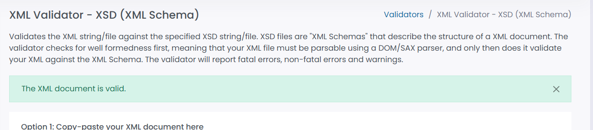

# CBITLearn - Web Programming Assignment 1

## Project Overview
This project is a multi-page static educational website developed for the **IV-Semester Assignment - I (Mar-2026)** at **Chaitanya Bharathi Institute of Technology (Autonomous)**. The platform allows users to explore courses, register for accounts, and submit inquiries to the institution.

## Live Deployment
The website is hosted via **GitHub Pages**.
**Live Site Link:** [https://bharathy2302.github.io/wpassignment164/](https://bharathy2302.github.io/wpassignment164/)

## Repository Structure
The project consists of the following essential files:
**index.html**: The Home page featuring a professional introduction and navigation menu.
**courses.html**: A catalog listing all available courses with detailed "Amazon-style" info cards.
**register.html**: A user registration form including Name, Email, and Password fields.
**contact.html**: A contact page providing the campus address, email, and an inquiry form.
**style.css**: An external stylesheet managing the site's layout, colors, and hover effects using a **Grid System**.
**website_data.xml**: A centralized XML file storing the website's data (courses and services).
**website_data.xsd**: A schema file used to validate the XML structure for data integrity.

## Key Features
* **Navigation**: Functional menu for seamless movement between separate HTML pages.
* **Interactive UI**: "Course Details" toggle functionality to reveal curriculum and duration on the Courses page.
* **Modern Styling**: Implementation of hover effects on buttons and links for enhanced user experience.

## XML and XSD Validation
This project utilizes a structured data approach by separating content from presentation:
1.  **XML Data Store**: All dynamic content like course titles, instructors, and contact details are managed in `website_data.xml`.
2.  **XSD Enforcement**: The `website_data.xsd` file acts as a validator, ensuring that all data entries follow strict rules (e.g., ensuring prices are numerical and ratings are within range).
3.  **Data Integrity**: This system prevents malformed data from affecting the website's structure, following professional software engineering standards.

---
**Course:** BE(CSE-3)  
**Subject:** Web Programming (WP)   
**Institution:** Chaitanya Bharathi Institute of Technology, Hyderabad
